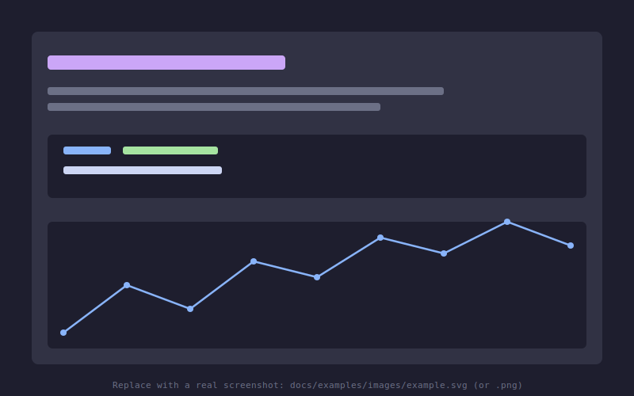

# Examples

The notebook below runs an EPA SWMM model with the bundled engine, then plots the
network, draws hydrographs and a longitudinal profile, and overlays the results on the
map.

To run the notebooks locally, install the dev environment and execute them:

```bash
pixi install -e dev
pixi r nb-run
```

<div class="grid cards" markdown>

- [{ loading=lazy }](example.ipynb "Run, plot, analyze a SWMM model")
    **Run, plot, analyze a SWMM model**

</div>
